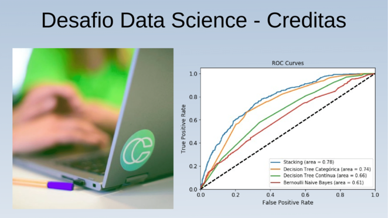
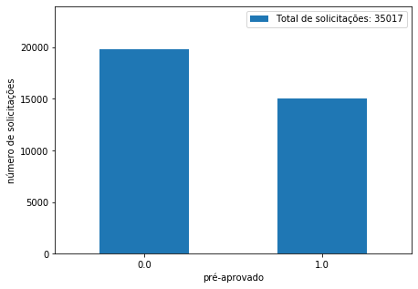
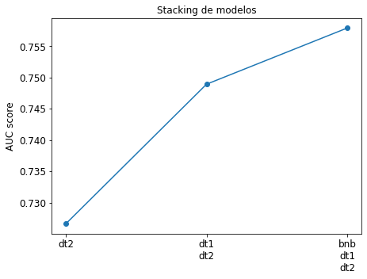
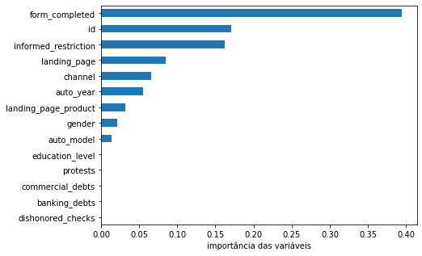
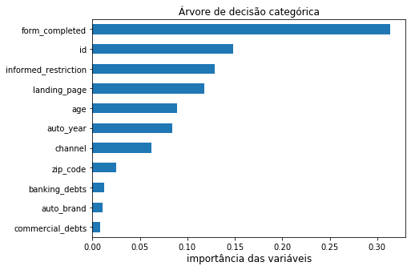

O objetivo é construir um modelo que permita priorizar os clientes de modo 
que aqueles com maior probabilidade de serem enviados para a análise de 
crédito sejam atendidos primeiro.

A solução do desafio e o código correspondente está implementado no
[jupyter notebook](notebook/modelo_de_prioridade_clientes.ipynb).

# Conteúdo

- [Análise exploratória dos dados](#análise-exploratoria-dos-dados)
- [Preparação dos dados](#preparação-dos-dados)
- [Modelos de classificação](#modelos-de-classificação)
  - [Bernoulli naive bayes](#bernoulli-naive-bayes)
  - [Árvore de decisão contínua](#árvore-de-decisão-contínua)
  - [Árvore de decisão categórica](#árvore-de-decisão-categórica)
  - [Stacking de modelos](#stacking-de-modelos)
- [Avaliação da solução](#avaliação-da-solução)
- [Importância das variáveis](#importância-das-variáveis)

# Análise exploratória dos dados

A análise dos dados permite observar os diferentes tipos de variáveis.
Cada linha do dataset corresponde a uma solicitação de crédito, sendo
que aquelas pré-aprovadas estão identificadas pela variável `pre_approved`.
Dessa forma, o público de modelagem consistirá será filtrados
pelo campo `pre_approved`.

Também foi estudada a variável `sent_to_analysis`, a qual indica se um cliente
é enviado para análise de credito. O modelo de classificação terá como objetivo
prever a variável `sent_to_analysis`, mostrada na figura 1.

Figura 1. Distribuição da variável `sent_to_analysis`.

A partir das informações fornecidas, o desafio foi enquadrado como um
problema de classificação supervisionada com variável respota de duas classes.
Em problemas de classificação é ideal que exista um balanceamento de classes
na variável resposta. Dependendo da magnitude do desbalanceamento, é possivel
aplicar técnicas de _sub-sampling_ ou _over-sampling_ para auxiliar o
treinamento dos modelos. Nesse desafio optamos por não aplicar nenhuma técnica
de balanceamento, e trabalhar com a distribuição desbalanceada de classes. 

# Preparação dos dados

Nesta etapa ponderamos as variáveis que entrarão no modelo de classificação e 
aplicamos os filtros necessários para eliminar informações menos relevantes.
O dataset inicial consiste de 32 colunas e um pouco mais de 30 mil linhas. Ao final
da etapa de pré-processamento, o resultado foi um dataset com **25 colunas** e pouco mais
de **10 mil** linhas.

O tratamento de valores nulos e remoção de _outliers_ foi feito tanto nas variáveis 
categóricas quanto nas variáveis numéricas. Também foi criada uma nova variável denominada
`collateral_net_value` a partir das variáveis `collateral_value` e `collateral_debt`. 
Referenente a remoção de _outliers_ utilizamos o percentil de 0.995 nas variáveis
continuas. No case das variáveis categóricas, a remoção foi feita manualmente.

O código correspondente está implementado na função [dataprep](python/myutils.py#L9).

# Modelos de classificação

A etapa de modelagem inicia com a separação do público em três conjuntos:
- 20% para validação
- 20% para teste
- 60% para treinamento.

A nossa estratégia de modelagem vai ser separar as variáveis por tipo e criar
um modelo separado para cada. Os tipos de variáveis são:
- Texto
- Contínuas
- Categóricas

## Bernoulli naive bayes
Este modelo visa a variável de texto `informed_purpose`. Utilizamos a técnica
_bag of words_ para vetorizar os textos, cujo resultado é um conjunto de variáveis 
_dummies_ indicando a presença de palavras. Posteriormente, selecionamos as melhores
_dummies_ utilizando um teste estatístico uni-variável. Finalmente, é treinado um
modelo de classificação _Naive Bayes_.

O código correspondente está implementado na função [clf_bnb](python/modelos.py#L14-L34). 

## Árvore de decisão contínua
O código correspondente está implementado na função [clf_dt1](python/modelos.py#L37-L58). 

## Árvore de decisão categórica
O código correspondente está implementado na função [clf_dt2](python/modelos.py#L61-L93). 

# Stacking de modelos

# Avaliação da solução

 
# Importância das variáveis

