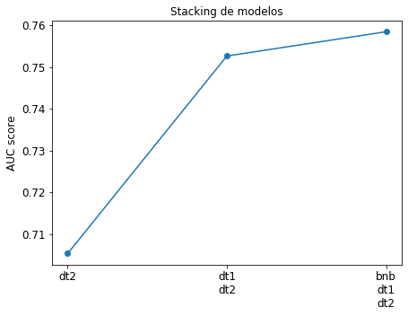
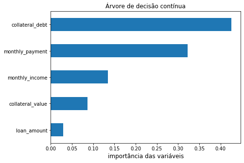

O objetivo é construir um modelo que permita priorizar os clientes de modo 
que aqueles com maior probabilidade de serem enviados para a análise de 
crédito sejam atendidos primeiro.

A solução do desafio e o código correspondente está implementado no
[jupyter notebook](notebook/modelo_de_prioridade_clientes.ipynb).

# Conteúdo

- [Análise exploratória dos dados](#análise-exploratoria-dos-dados)
- [Preparação dos dados](#preparação-dos-dados)
- [Modelos de classificação](#modelos-de-classificação)
  - [Bernoulli naive bayes](#bernoulli-naive-bayes)
  - [Árvore de decisão contínua](#árvore-de-decisão-contínua)
  - [Árvore de decisão categórica](#árvore-de-decisão-categórica)
  - [Stacking de modelos](#stacking-de-modelos)
- [Avaliação da solução](#avaliação-da-solução)
- [Importância das variáveis](#importância-das-variáveis)

# Análise exploratória dos dados

A análise dos dados permite observar os diferentes tipos de variáveis.
Cada linha do dataset corresponde a uma solicitação de crédito, sendo
que aquelas pré-aprovadas estão identificadas pela variável `pre_approved`.
Dessa forma, o público de modelagem consistirá será filtrados
pelo campo `pre_approved`.

Também foi estudada a variável `sent_to_analysis`, a qual indica se um cliente
é enviado para análise de credito. O modelo de classificação terá como objetivo
prever a variável `sent_to_analysis`, mostrada na figura 1.

Figura 1. Distribuição da variável `sent_to_analysis`.

A partir das informações fornecidas, o desafio foi enquadrado como um
problema de classificação supervisionada com variável respota de duas classes.
Em problemas de classificação é ideal que exista um balanceamento de classes
na variável resposta. Dependendo da magnitude do desbalanceamento, é possivel
aplicar técnicas de _sub-sampling_ ou _over-sampling_ para auxiliar o
treinamento dos modelos. Nesse desafio optamos por não aplicar nenhuma técnica
de balanceamento, e trabalhar com a distribuição desbalanceada de classes. 

# Preparação dos dados

Nesta etapa ponderamos as variáveis que entrarão no modelo de classificação e 
aplicamos os filtros necessários para eliminar informações menos relevantes.
O dataset inicial consiste de 32 colunas e um pouco mais de 30 mil linhas. Ao final
da etapa de pré-processamento, o resultado foi um dataset com **25 colunas** e pouco mais
de **14 mil** linhas.

Adicionalmente, foi feito um tratamento de _outliers_ nas variáveis categóricas
`auto_brand` e `landing_page`.

O código correspondente está implementado na função [dataprep](python/myutils.py#L19-L51).

# Modelos de classificação

A etapa de modelagem inicia com a separação do público em três conjuntos:
- 20% para validação
- 20% para teste
- 60% para treinamento.

A nossa estratégia de modelagem vai ser separar as variáveis por tipo e criar
um modelo separado para cada. Os tipos de variáveis são:
- Texto
- Contínuas
- Categóricas

## Bernoulli naive bayes
Modelo para a variável de texto `informed_purpose`. Utilizamos a técnica
_bag of words_ para vetorizar os textos, cujo resultado é um conjunto de variáveis 
_dummies_ indicando a presença de palavras. Posteriormente, selecionamos as melhores
_dummies_ utilizando um teste estatístico uni-variável. Finalmente, é treinado um
modelo de classificação _Naive Bayes_.

O código correspondente está implementado na função [clf_bnb](python/modelos.py#L16-L42). 

## Árvore de decisão contínua
Modelo para as variáveis
- `monthly_income`
- `loan_amount`
- `monthly_payment`
- `collateral_debt`
- `collateral_value`

Previamente os valores núlos foram imputados com a mediana de cada variável. 
O modelo treinado foi uma árvore de decisão com parâmetro de profundiade `max_depth=5`.

O código correspondente está implementado na função [clf_dt1](python/modelos.py#L45-L63). 

## Árvore de decisão categórica
Modelo para as variáveis
- `id`
- `age`
- `zip_code`
- `banking_debts`
- `commercial_debts`
- `auto_year`
- `auto_brand`
- `informed_restriction`
- `form_completed`
- `channel`
- `landing_page`

Previamente os valores núlos foram imputados com o valor mais frequênte de cada variável. 
Em seguida, as variáveis categóricas foram transformadas em numéricas. Finalmente, 
foi treinada uma árvore de decisão com parâmetro de profundiade `max_depth=6`.

O código correspondente está implementado na função [clf_dt2](python/modelos.py#L66-L99). 

# Stacking de modelos
Cada um dos modelos anteriores retorna a probabilidade que um cliente tem de ser enviado
para análise de crédito dado que ele foi pré-aprovado. É possivel combinar os três modelos
fazendo uma regressão logística utilizando as probabilidades dos modelos anteriores como
variáveis explicativas. O resultado deste procedimento se mostra na figura 2. 

Figura 2. Stacking dos modelos. O resultado de combinar os três modelos é superior a
qualquer um dos modelos individualmente.

# Avaliação da solução

Foi utilizada o área sob a curva ROC como métrica de avaliação. Por se tratar de um problema
com classes desbalanceadas, a avaliação do modelo atraves da curva ROC é mais conveniente.
O melhor resultado foi obtivo para o modelo de stacking, sendo que **area = 0.76**.

Figura 3. Métrica de avaliação. 

 
# Importância das variáveis

As figuras 4 e 5 mostram as variáveis contínuas e categóricas, respectivamente, ordenadas pela
sua importância para o modelo construído. 

Figura 4. Importância das variáveis contínua.

Figura 5. Importância das variáveis categóricas.

