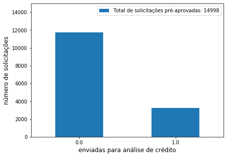
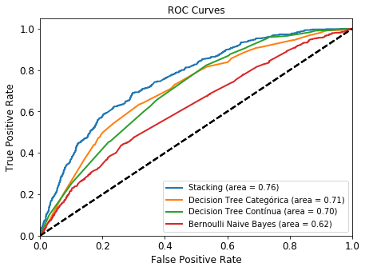

# Modelo de Priorização de Clientes

O objetivo é priorizar os clientes de maneira que aqueles com maior
probabilidade de serem enviados para a análise de crédito sejam atendidos
primeiro.

A partir dos dados fornecidos, o modelo pode ser enquadrado como um
problema de classificação supervisionada, utilizando como _target_ 
a variável `sent_to_analysis`.

## Conteúdo

- Análise exploratória dos dados
- Pré-processamento, limpeza, e remoção de dados
- Modelos de classificação
  - Bernoulli naive bayes
  - Árvore de decisão contínua
  - Árvore de decisão categórica
  - Stacking de modelos
- Avaliação da solução
- Importância das variáveis

## Análise exploratória dos dados

## Pré-processamento, limpeza, e remoção de dados

## Modelos de classificação

### Bernoulli naive bayes
### Árvore de decisão contínua
### Árvore de decisão categórica
### Stacking de modelos

## Avaliação da solução

## Importância das variáveis

